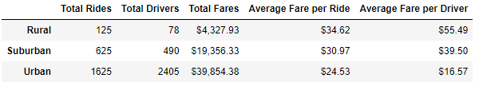
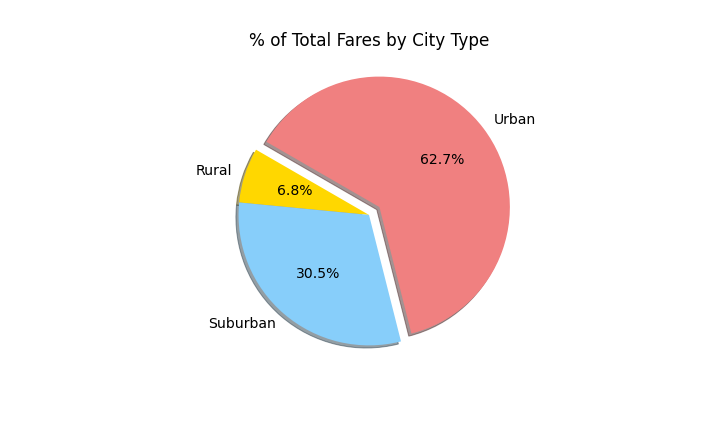
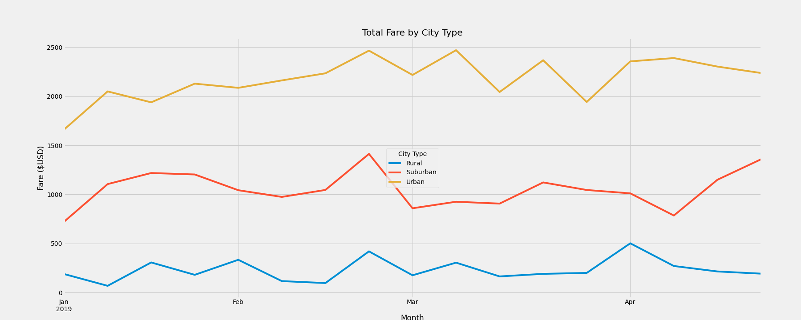

# PyBer_Analysis

## Overview and Challenge Objective
Throughout the PyBer Analysis module, we have utilized the graphical abilities of Pandas to provide visual representations of the data collected for PyBer rideshare trips. Prior to the challenge segment of the module, we have worked to provide summary information on the rideshare data, usually sorting by city type: urban, suburban, or rural. 

The objective of the challenge was to develop a dataframe that presents summary data by city type, and then to transform the rideshare data to provide a week-by-week line chart that shows the total weekly fares for each of our three city types. This data will be provided to key decision-makers at PyBer along with recommendations to improve ride access, ride profitability, and potential areas for ride volume growth.

## Challenge Results:
### PyBer Summary Data by City Type
The raw data provided as a .csv file for each city as well as for each individual ride was merged into a single dataframe. Total counts for rides by city type, drivers by city type, and total fares per city type were calculated from the merged dataframe. From this data, average fare per ride per city type and average fare per driver per city type were derived. The subsequent dataframe created from the data is as follows:

Total rides, drivers, and fares collected were highest for the urban cities and lowest for the rural cities. The urban totals are an order of magnitude greater than the rural totals. The density and volume of potential customers for the urban cities makes these results appear reasonable. In terms of total counts of fares, the urban cities accounted for 62.7% of all rides.

Similar trends were seen for the total counts of drivers per city type:

as well as for total counts of rides per city type:

Though the total values greatly favored a focus on urban centers -- on a ride-by-ride basis, as well as a per-driver basis -- average fares and fares per driver favored the rural cities over the suburban and urban cities. The average fare per driver in an urban city was $16.57, while it was $55.49 for a rural city. The average fare per ride demonstrated a similar trend, where the average urban fare per ride was $24.53 while the average rural fare per ride was $34.62. These values seem reasonable given the assumption that a rural city is going to be further spread out, increasing drive times and lowering the potential pool of drivers -- the latter value certainly expected to be correlated with city density.

### PyBer Total Weekly Total Fares by City Type
A line chart was developed to present weekly information presenting total fares by city type.

The yellow line represents the total fares collected in urban cities on a weekly basis. The orange line represents the same information for suburban cities, and the blue for rural cities. At no point in time do the weekly urban total fares dip below the weekly suburban total fares, nor do either dip below the weekly total fares. At no point did rural (or suburban) city total fares eclipse the urban total fares collected. In addition, the total fares for each city type generally move in concert, experiencing surges and dips in the same weeks. Though all three city types saw a marked increase in total fares collected the third week of February (I bet they were all getting a jump on celebrating Leap Day if it was a leap year and Leap Day [observed] if it wasn't...), the volatility was low compared to the overall trends for each city type. If we were to perform additional statistical analysis on these datasets, it is unlikely any weekly datapoints would be outliers.

## Conclusions
Though the average fare per ride and per driver were higher for the rural cities, the total fares, drivers, and rides were significantly higher for the urban centers. 
- This would indicate that there is more money to be made by focusing business on the urban cities. 
- One piece of data not considered in this analysis is the length of time each ride took. A per-minute evaluation of fares would be beneficial to understanding best how to allocate drivers (either through financial motivation or re-jiggering the algorithms matching drivers to riders) to maximize the time-based profit. 
- Cost controls may also be necessary in urban centers to ensure that rides don't become so expensive as to scare away potential new customers, or to drive them to use rival company Pyft instead. 

In conclusion, the use patterns and average fares differ between the three city types. This indicates that no one strategy will be effective in promoting growth in all three city types. Future consideration should be provided to understand the needs of clients in each different city type, and to provide enticements for both drivers and riders that will increase the use across each different city type.
